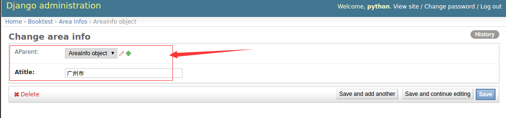
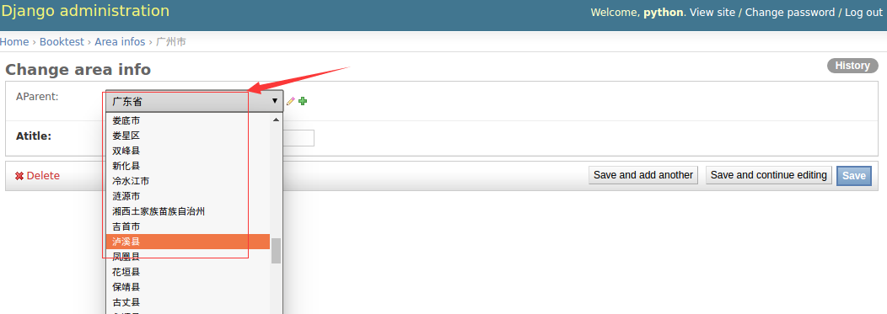
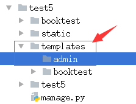
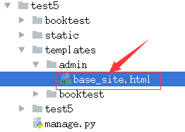

# Django
======

## 1. 软件框架
--------

> 
>
> 一个公司是由公司中的各部部门来组成的，每一个部门拥有特定的职能，部门与部门之间通过相互的配合来完成让公司运转起来。
>
> 一个软件框架是由其中各个软件模块组成的，每一个模块都有特定的功能，模块与模块之间通过相互配合来完成软件的开发。
>
> 软件框架是针对某一类软件设计问题而产生的。

## 2. MVC框架
-------

### 2.1 MVC简介

> MVC最初是由施乐公司旗下的帕罗奥多研究中心中的一位研究人员给
> smalltalk语言发明的一中软件设计模式。
>
> MVC的产生理念： **分工**。让专门的人去做专门的事。
>
> MVC的核心思想： **解耦**。


MVC的思想被应用在的web开发的方面，产生了**web MVC框架**。

### 2.2 Web MVC框架模块功能

通过浏览器注册用户信息。


> M:Model,模型， 和数据库进行交互。
>
> V:View,视图， 产生html页面。
>
> C:Controller,控制器, 接收请求，进行处理，与M和V进行交互，返回应答。

## 3. Django框架 
-----------

### 3.1 简介

> Django是劳伦斯出版集团的开发人员为开发新闻内容网站而设计出来的一个软件，它遵循MVC思想，但是有自己的一个名词，叫做**MVT**。
>
> Django遵循快速开发和DRY原则。Do not repeat
> yourself.不要自己去重复一些工作。

### 3.2 MVT各部分功能

> 
>
> M:Model,模型， 和MVC中M功能相同，和数据库进行交互。
>
> V:View,视图，
> 和MVC中C功能相同，接收请求，进行处理，与M和T进行交互，返回应答。
>
> T:Template,模板， 和MVC中V功能相同，产生html页面。

## 4. 虚拟环境
--------

### 4.1 概念


之前安装python包的命令： sudo pip3 install 包名

包的安装路径：/usr/local/lib/python3.5/dist-packages

在同一个python环境中安装同一个包的不同版本，后安装的包会把原来安装的包覆盖掉。这样，如果同一台机器上两个项目依赖于相同包的不同版本，则会导致一些项目运行失败。

解决的方案就是：虚拟环境。

**虚拟环境是真实python环境的复制版本。**

**在虚拟环境中使用的python是复制的python,安装python包也是安装在复制的python中。**

### 4.2 安装和配置

**安装虚拟环境的命令：**

1）sudo pip install virtualenv \#安装虚拟环境

2）sudo pip install virtualenvwrapper \#安装虚拟环境扩展包

3）编辑家目录下面的.bashrc文件，添加下面两行。

> **export WORKON\_HOME=\$HOME/.virtualenvs**
>
> **source /usr/local/bin/virtualenvwrapper.sh**

4）使用source .bashrc使其生效一下。

### 4.3 使用

**创建虚拟环境命令：**

mkvirtualenv 虚拟环境名

**创建python3虚拟环境：**

mkvirtualenv -p python3 bj11\_py3

**进入虚拟环境工作：**

workon 虚拟环境名

**查看机器上有多少个虚拟环境：**

workon 空格 + 两个tab键

**退出虚拟环境：**

deactivate

**删除虚拟环境：**

rmvirtualenv 虚拟环境名

虚拟环境下安装包的命令：

pip install 包名

注意：不能使用sudo pip install
包名，这个命令会把包安装到真实的主机环境上而不是安装到虚拟环境中。

**查看虚拟环境中安装了哪些python包：**

pip list

pip freeze

**安装django环境：**

pip install django==1.8.2

**拓展:**

apt-get install 软件

pip install python包名

## 5. 项目创建
--------

### 5.1 创建Django项目

命令：django-admin startproject 项目名

注意：创建应用必须先进入虚拟环境。

项目目录如下：


\_\_init\_\_.py: 说明test1是一个python包。

settings.py: 项目的配置文件。

urls.py: 进行url路由的配置。

wsgi.py: web服务器和Django交互的入口。

manage.py: 项目的管理文件。

### 5.2 创建Django应用


一个项目由很多个应用组成的，每一个应用完成一个功能模块。

创建应用的命令如下：

python manage.py startapp 应用名

注意：创建应用时需要先进入项目目录。

应用目录如下：


\_\_init\_\_.py: 说明目录是一个Python模块。

models.py: 写和数据库项目的内容, 设计模型类。

views.py: ，接收请求，进行处理，与M和T进行交互，返回应答。

定义处理函数，视图函数。

tests.py: 写测试代码的文件。

admin.py: 网站后台管理相关的文件。

### 5.3 应用注册

建立应用和项目之间的联系，需要对应用进行注册。

修改settings.py中的INSTALLED\_APPS配置项。

### 5.4 启动项目

运行开发web服务器命令：

python manage.py runserver

## 6. 模型类
------

### 6.1 ORM


django中内嵌了ORM框架，ORM框架可以将类和数据表进行对应起来，只需要通过类和对象就可以对数据表进行操作。

在Django中主要是设计类：模型类。

ORM另外一个作用：根据设计的类生成数据库中的表。

### 6.2 模型类设计

在应用models.py中设计模型类。

必须继承与models.Model类。

1.  设计BookInfo类。

2.  设计HeroInfo类。

Models.ForeignKey可以建立两个模型类之间一对多的关系，django在生成表的时候，就会在多端的表中创建一列作为外键，建立两个表之间一对多的关系。

###  6.3 模型类生成表

1)  生成迁移文件

> 命令：python manage.py makemigrations
>
> 
>
> 迁移文件是根据模型类生成的。

1)  执行迁移生成表

> 命令：python mange.py migrate
>
> 根据迁移文件生成表。
>
> 生成表名的默认格式：
>
> 应用名\_模型类名小写

### 6.4 通过模型类操作数据表

进入项目shell的命令:

python manage.py shell

以下为在相互shell终端中演示的例子：

首先导入模型类：

from booktest.models import BookInfo,HeroInfo

1)  **向booktest\_bookinfo表中插入一条数据。**

b = BookInfo() \#定义一个BookInfo类的对象

b.btitle ='天龙八部' \#定义b对象的属性并赋值

b.bpub\_date = date(1990,10,11)

b.save() \#才会将数据保存进数据库

**2) 查询出booktest\_bookinfo表中id为1的数据。**

b = BookInfo.objects.get(id=1)

**3) 在上一步的基础上改变b对应图书的出版日期。**

b.bpub\_date = date(1989,10,21)

b.save() \#才会更新表格中的数据

**4) 紧接上一步，删除b对应的图书的数据。**

b.delete() \#才会删除

**5) 向booktest\_heroInfo表中插入一条数据。**

h = HeroInfo()

h.hname = '郭靖'\
h.hgender = False

h.hcomment = ‘降龙十八掌’

b2 = BookInfo.objects.get(id=2)

h.hbook = b2 \#给关系属性赋值，英雄对象所属的图书对象

h.save()

**6) 查询图书表里面的所有内容。**

BookInfo.objects.all()

HeroInfo.objects.all()

### 6.5 关联操作

1) 查询出id为2的图书中所有英雄人物的信息。

b = BookInfo.objects.get(id=2)

b.heroinfo\_set.all() \#查询出b图书中所有英雄人物的信息

## 7. 后台管理
-----------

1)  本地化

> 语言和时区的本地化。
>
> 修改settings.py文件。

1)  创建管理员

> 命令：python manage.py createsuperuser

1)  注册模型类

> 在应用下的admin.py中注册模型类。
>
> 告诉djang框架根据注册的模型类来生成对应表管理页面。
>
> b = BookInfo()
>
> str(b) \_\_str\_\_

1)  自定义管理页面

> 自定义模型管理类。模型管理类就是告诉django在生成的管理页面上显示哪些内容。

## 8. 视图
----

在Django中，通过浏览器去请求一个页面时，使用视图函数来处理这个请求的，视图函数处理之后，要给浏览器返回页面内容。

### 8.1视图函数的使用

1\) 定义视图函数

视图函数定义在views.py中。

例：

def index(request):

\#进行处理。。。

return HttpResponse('hello python')

视图函数必须有一个参数request，进行处理之后，需要返回一个HttpResponse的类对象，hello
python就是返回给浏览器显示的内容。

1)  进行url配置


url配置的目的是让建立url和视图函数的对应关系。url配置项定义在urlpatterns的列表中，每一个配置项都调用url函数。

url函数有两个参数，第一个参数是一个正则表达式，第二个是对应的处理动作。

配置url时，有两种语法格式：

a\) url(正则表达式，视图函数名)

b\) url(正则表达式，include(应用中的urls文件))

工作中在配置url时，首先在项目的urls.py文件中添加配置项时，并不写具体的url和视图函数之间的对应关系，而是包含具体应用的urls.py文件，在应用的urls.py文件中写url和视图函数的对应关系。

### 8.2 url匹配的过程

在项目的urls.py文件中包含具体应用的urls.py文件，应用的urls.py文件中写url和视图函数的对应关系。


当用户输入如[*http://127.0.0.1:8000/aindex*](http://127.0.0.1:8000/aindex)时，去除域名和最前面的/，剩下aindex，拿aindex字符串到项目的urls文件中进行匹配，配置成功之后，去除匹配的a字符，那剩下的index字符串继续到应用的urls文件中进行正则匹配，匹配成功之后执行视图函数index，index视图函数返回内容hello
python给浏览器来显示。

## 9. 模板
----

模板不仅仅是一个html文件。

### 9.1 模板文件的使用

1)  创建模板文件夹

2)  配置模板目录

3) 使用模板文件

a)  加载模板文件

> 去模板目录下面获取html文件的内容，得到一个模板对象。

a)  定义模板上下文

> 向模板文件传递数据。

a)  模板渲染

> 得到一个标准的html内容。

### 9.2 给模板文件传递数据

模板变量使用：{{ 模板变量名 }}

模板代码段：

for循环：



list不为空时执行的逻辑



list为空时执行的逻辑



## 10. 案例完成
---------

编码之前的准备工作：

1)  设计出访问页面的url和对应的视图函数的名字，确定视图函数的功能。

2)  设计模板文件的名字。

**以下为案例中的简单设计过程：**

1)  完成图书信息的展示：

<!-- -->

a)  设计url，通过浏览器访问 [*http://127.0.0.1:8000/books
    时显示图书信息页面*](http://127.0.0.1:8000/books/%20时显示图书信息页面)。

b)  设计url对应的视图函数show\_books。

> 查询出所有图书的信息，将这些信息传递给模板文件。

a)  编写模板文件show\_books.html。

> 遍历显示出每一本图书的信息。

1)  完成点击某本图书时，显示出图书里所有英雄信息的页面。

<!-- -->

a)  设计url,通过访问http://127.0.0.1:8000/books/数字时显示对应的英雄信息页面。

> 这里数字指点击的图书的id。

a)  设计对应的视图函数detail。

接收图书的id,根据id查询出相应的图书信息，然后查询出图书中的所有英雄信息。

a)  编写模板文件detail.html。

# 模型
====

## 1. Django ORM
----------


O(objects):类和对象。

R(Relation):关系，关系数据库中的表格。

M(Mapping):映射。

**Django ORM框架的功能：**

a)  建立模型类和表之间的对应关系，允许我们通过面向对象的方式来操作数据库。

b)  根据设计的模型类生成数据库中的表格。

c)  通过方便的配置就可以进行数据库的切换。

## 2. Django数据库配置
-----------------

### 2.1 mysql命令回顾

登录mysql数据库:mysql –uroot –p

查看有哪些数据库:show databases

创建数据库:create database test2 **charset=utf8;** **\#切记:指定编码**

使用数据库：use test2;

查看数据库中的表：show tables;

### 2.2 Django配置使用mysql数据库

修改settings.py中的DATABASES。


注意：django框架不会自动帮我们生成mysql数据库，所以我们需要自己去创建。

### 2.3 切换mysql数据库之后不能启动服务器

需要安装操作mysql数据库的包，python2环境和python3环境有以下区别。

a)  **python2需要安装mysql-python:**

pip install mysql-python

a)  **python3需要安装pymysql**:

pip install pymysql

python3中安装好pymysql，需要在test2/\_\_init\_\_.py中加如下内容：

> import pymysql
>
> pymysql.install\_as\_MySQLdb()

## 3. 复习案例
---------

1)  设计模型类并生成表

<!-- -->

a)  设计BookInfo,增加属性bread和bcomment，另外设置软删除标记属性isDelete。

b)  设计HeroInfo类，增加软删除标记属性isDelete。

> 软删除标记：删除数据时不做真正的删除，而是把标记数据设置为1表示删除，目的是防止重要的数据丢失。

1)  编写视图函数并配置URL。

3）创建模板文件。

**拆解功能：**

1)  图书信息展示页。

<!-- -->

a)  设计url，通过浏览器访问
    [*http://127.0.0.1:8000/index时显示图书信息页面*](http://127.0.0.1/index/%20时显示图书信息页面)。

b)  设计url对应的视图函数index。

> 查询出所有图书的信息，将这些信息传递给模板文件。

a)  编写模板文件index.html。

> 遍历显示出每一本图书的信息并增加新建和删除超链接。

2）图书信息新增。

> a）设计url，通过浏览器访问
> [*http://127.0.0.1:8000/create时向数据库中新增一条图书信息*](http://127.0.0.1:8000/create/时向数据库中新增一条图书信息)。
>
> b\) 设计url对应得视图函数create。
>
> 
>
> 页面重定向：服务器不返回页面，而是告诉浏览器再去请求其他的url地址。

3）图书信息删除。

> a）设计url，通过浏览器访问
> [*http://127.0.0.1:8000/delete*](http://127.0.0.1:8000/delete)数字删除数据库中对应的一条图书数据。
>
> 其中数字是点击的图书的id。
>
> b)设计url对应的视图函数delete。
>
> 获取图书的id,进行删除。

## 4. 字段属性和选项
--------------

### 4.1 模型类属性命名限制

1）不能是python的保留关键字。

2）不允许使用连续的下划线，这是由django的查询方式决定的。

3）定义属性时需要指定字段类型，通过字段类型的参数指定选项，语法如下：

属性名=models.字段类型(选项)

### 4.2 字段类型

使用时需要引入django.db.models包，字段类型如下：

  -----------------------------------------------------------------------------------------------------------------------------------------------------------------------------------------
  类型                                                         描述
  ------------------------------------------------------------ ----------------------------------------------------------------------------------------------------------------------------
  **AutoField**                                                自动增长的IntegerField，通常不用指定，不指定时Django会自动创建属性名为id的自动增长属性。

  **BooleanField**                                             布尔字段，值为True或False。

  **NullBooleanField**                                         支持Null、True、False三种值。

  **CharField**(max\_length=最大长度)                          字符串。参数max\_length表示最大字符个数。

  **TextField**                                                大文本字段，一般超过4000个字符时使用。

  **IntegerField**                                             整数

  **DecimalField**(max\_digits=None, decimal\_places=None)     十进制浮点数。参数max\_digits表示总位。参数decimal\_places表示小数位数。

  **FloatField**                                               浮点数。参数同上

  **DateField：**(\[auto\_now=False, auto\_now\_add=False\])   日期。
                                                               
                                                               1)参数auto\_now表示每次保存对象时，自动设置该字段为当前时间，用于"最后一次修改"的时间戳，它总是使用当前日期，默认为false。
                                                               
                                                               2) 参数auto\_now\_add表示当对象第一次被创建时自动设置当前时间，用于创建的时间戳，它总是使用当前日期，默认为false。
                                                               
                                                               3)参数auto\_now\_add和auto\_now是相互排斥的，组合将会发生错误。

  **TimeField**                                                时间，参数同DateField。

  **DateTimeField**                                            日期时间，参数同DateField。

  **FileField**                                                上传文件字段。

  **ImageField**                                               继承于FileField，对上传的内容进行校验，确保是有效的图片。
  -----------------------------------------------------------------------------------------------------------------------------------------------------------------------------------------

### 4.3 选项

通过选项实现对字段的约束，选项如下：

  选项名             描述
  ------------------ --------------------------------------------------------------------------------------
  **default**        默认值。设置默认值。
  **primary\_key**   若为True，则该字段会成为模型的主键字段，默认值是False，一般作为AutoField的选项使用。
  **unique**         如果为True, 这个字段在表中必须有唯一值，默认值是False。
  **db\_index**      若值为True, 则在表中会为此字段创建索引，默认值是False。
  **db\_column**     字段的名称，如果未指定，则使用属性的名称。
  **null**           如果为True，表示允许为空，默认值是False。
  **blank**          如果为True，则该字段允许为空白，默认值是False。

对比：null是数据库范畴的概念，blank是后台管理页面表单验证范畴的。

**经验:**

当修改模型类之后，如果添加的选项不影响表的结构，则不需要重新做迁移，商品的选项中default和blank不影响表结构。

**参考文档:**

**http://python.usyiyi.cn/translate/django\_182/index.html**

## 5. 查询
-----

### 5.1 mysql的日志文件

mysql.log是mysql的日志文件，里面记录的对MySQL数据库的操作记录。默认情况下mysql的日志文件没有产生，需要修改mysql的配置文件，步骤如下：

1)  使用下面的命令打开mysql的配置文件，去除68,69行的注释，然后保存。

> sudo vi /etc/mysql/mysql.conf.d/mysqld.cnf

2）重启mysql服务，就会产生mysql日志文件。

sudo service mysql restart

3）打开MySQL的日志文件。

/var/log/mysql/mysql.log 是mysql日志文件所在的位置。

使用下面的命令可以实时查看mysql的日志文件:

> sudo tail -f /var/log/mysql/mysql.log

### 5.2 查询函数

通过模型类.objects属性可以调用如下函数，实现对模型类对应的数据表的查询。

  -------------------------------------------------------------------------------------------------------------------------------------------
  函数名      功能                                       返回值                     说明
  ----------- ------------------------------------------ -------------------------- ---------------------------------------------------------
  get         返回表中满足条件的一条且只能有一条数据。   返回值是一个模型类对象。   参数中写查询条件。
                                                                                    
                                                                                    1)  如果查到多条数据，则抛异常MultipleObjectsReturned。
                                                                                    
                                                                                    2)查询不到数据，则抛异常：DoesNotExist。

  all         返回模型类对应表格中的所有数据。           返回值是QuerySet类型       查询集

  filter      返回满足条件的数据。                       返回值是QuerySet类型       参数写查询条件。

  exclude     返回不满足条件的数据。                     返回值是QuerySet类型       参数写查询条件。

  order\_by   对查询结果进行排序。                       返回值是QuerySet类型       参数中写根据哪些字段进行排序。
  -------------------------------------------------------------------------------------------------------------------------------------------

**get示例：**

例：查询图书id为3的图书信息。

**all方法示例：**

例：查询图书所有信息。

**filter方法示例：**

条件格式：

模型类属性名\_\_条件名=值

查询图书评论量为34的图书的信息：

**a)判等 条件名:exact。**

例：查询编号为1的图书。

BookInfo.objects.get(id=1)

**b)模糊查询**

例：查询书名包含'传'的图书。contains

BookInfo.objects.filter(btitle\_\_contains='传')

例：查询书名以'部'结尾的图书 endswith 开头:startswith

BookInfo.objects.filter(btitle\_\_endswith='部')

**c)空查询 isnull**

例：查询书名不为空的图书。isnull

select \* from booktest\_bookinfo where btitle is not null;

BookInfo.objects.filter(btitle\_\_isnull=False)

**d)范围查询** in

例：查询id为1或3或5的图书。

select \* from booktest\_bookinfo where id in (1,3,5);

BookInfo.objects.filter(id\_\_in = \[1,3,5\])

**e)比较查询** gt(greate than) lt(less than) gte(equal) 大于等于

lte 小于等于

例：查询id大于3的图书。

Select \* from booktest\_bookinfo where id&gt;3;

BookInfo.objects.filter(id\_\_gt=3)

**f)日期查询**

例：查询1980年发表的图书。

BookInfo.objects.filter(bpub\_date\_\_year=1980)

例：查询1980年1月1日后发表的图书。

from datetime import date

BookInfo.objects.filter(bpub\_date\_\_gt=date(1980,1,1))

**exclude方法示例：**

例：查询id不为3的图书信息。

BookInfo.objects.exclude(id=3)

**order\_by方法示例：**

**作用：**进行查询结果进行排序。

例：查询所有图书的信息，按照id从小到大进行排序。

BookInfo.objects.all().order\_by('id')

例：查询所有图书的信息，按照id从大到小进行排序。

BookInfo.objects.all().order\_by('-id')

例：把id大于3的图书信息按阅读量从大到小排序显示。

BookInfo.objects.filter(id\_\_gt=3).order\_by('-bread')

## 6. F对象
-----

**作用：**用于类属性之间的比较。

**使用之前需要先导入**：

from django.db.models import F

例：查询图书阅读量大于评论量图书信息。

BookInfo.objects.filter(bread\_\_gt=F('bcomment'))

例：查询图书阅读量大于2倍评论量图书信息。

BookInfo.objects.filter(bread\_\_gt=F('bcomment')\*2)

## 7. Q对象
-----

**作用：**用于查询时条件之间的逻辑关系。not and
or，可以对Q对象进行&|\~操作。

**使用之前需要先导入：**

from django.db.models import Q

例：查询id大于3且阅读量大于30的图书的信息。

BookInfo.objects.filter(id\_\_gt=3, bread\_\_gt=30)

BookInfo.objects.filter(Q(id\_\_gt=3)&Q(bread\_\_gt=30))

例：查询id大于3或者阅读量大于30的图书的信息。

BookInfo.objects.filter(Q(id\_\_gt=3)|Q(bread\_\_gt=30))

例：查询id不等于3图书的信息。

BookInfo.objects.filter(\~Q(id=3))

## 8. 聚合函数 
---------

**作用：**对查询结果进行聚合操作。

sum count avg max min

**aggregate：调用这个函数来使用聚合。 返回值是一个字典**

**使用前需先导入聚合类： **

from django.db.models import Sum,Count,Max,Min,Avg

例：查询所有图书的数目。

BookInfo.objects.all().aggregate(Count('id'))

{'id\_\_count': 5}

例：查询所有图书阅读量的总和。

BookInfo.objects.aggregate(Sum('bread'))

{'bread\_\_sum': 126}

**count函数 返回值是一个数字**

作用：统计满足条件数据的数目。

例：统计所有图书的数目。

BookInfo.objects.all().count()

BookInfo.objects.count()

例：统计id大于3的所有图书的数目。

BookInfo.objects.filter(id\_\_gt=3).count()

小结:


**参考文档：**

http://python.usyiyi.cn/translate/django\_182/ref/models/querysets.html

## 9. 查询集
------

all, filter, exclude,
order\_by调用这些函数会产生一个查询集，QuerySet类对象可以继续调用上面的所有函数。

### 9.1 查询集特性

1.  惰性查询：只有在实际使用查询集中的数据的时候才会发生对数据库的真正查询。

2.  缓存：当使用的是同一个查询集时，第一次使用的时候会发生实际数据库的查询，然后把结果缓存起来，之后再使用这个查询集时，使用的是缓存中的结果。

### 9.2 限制查询集

可以对一个查询集进行取下标或者切片操作来限制查询集的结果。

对一个查询集进行切片操作**会产生一个新的查询集**，下标不允许为负数。

取出查询集第一条数据的两种方式:

  方式             说明
  ---------------- ----------------------------------------------------
  b\[0\]           如果b\[0\]不存在，会抛出IndexError异常
  b\[0:1\].get()   如果b\[0:1\].get()不存在，会抛出DoesNotExist异常。

**exists:判断一个查询集中是否有数据。True False**

## 10. 模型类关系
----------

1.  一对多关系

> 例：图书类-英雄类
>
> models.ForeignKey() 定义在多的类中。

1.  多对多关系

> 例：新闻类-新闻类型类 体育新闻 国际新闻
>
> models.ManyToManyField() 定义在哪个类中都可以。

1.  一对一关系

> 例：员工基本信息类-员工详细信息类. 员工工号
>
> models.OneToOneField定义在哪个类中都可以。

## 11. 关联查询（一对多）
------------------

### 11.1 查询和对象关联的数据

在一对多关系中，一对应的类我们把它叫做一类，多对应的那个类我们把它叫做多类，我们把多类中定义的建立关联的类属性叫做关联属性。

例：查询id为1的图书关联的英雄的信息。

b=BookInfo.objects.get(id=1)

b.heroinfo\_set.all()

**通过模型类查询：**

HeroInfo.objects.filter(hbook\_\_id=1)

例：查询id为1的英雄关联的图书信息。

h = HeroInfo.objects.get(id=1)

h.hbook

**通过模型类查询：**

BookInfo.objects.filter(heroinfo\_\_id=1)

**格式：**


由一类的对象查询多类的时候：

一类的对象.多类名小写\_set.all() \#查询所用数据

由多类的对象查询一类的时候：

多类的对象.关联属性 \#查询多类的对象对应的一类的对象

由多类的对象查询一类对象的id时候：

多类的对象. 关联属性\_id

### 11.2 通过模型类实现关联查询


例：查询图书信息，要求图书关联的英雄的描述包含'八'。

BookInfo.objects.filter(heroinfo\_\_hcomment\_\_contains='八')

例：查询图书信息，要求图书中的英雄的id大于3.

BookInfo.objects.filter(heroinfo\_\_id\_\_gt=3)

例：查询书名为“天龙八部”的所有英雄。

HeroInfo.objects.filter(hbook\_\_btitle='天龙八部')

通过多类的条件查询一类的数据：

一类名.objects.filter(多类名小写\_\_多类属性名\_\_条件名)

通过一类的条件查询多类的数据：

多类名.objects.filter(关联属性\_\_一类属性名\_\_条件名)

## 12. 插入、更新和删除
----------------

调用一个模型类对象的save方法的时候就可以实现对模型类对应数据表的插入和更新。

调用一个模型类对象的delete方法的时候就可以实现对模型类对应数据表数据的删除。

## 13. 自关联
------


自关联是一种特殊的一对多的关系。

案例：显示广州市的上级地区和下级地区。

地区表：id, atitle, aParent\_id;

mysql终端中批量执行sql语句：source areas.sql;

## 14. 管理器
------

BookInfo.objects.all()-&gt;objects是一个什么东西呢？

答：objects是Django帮我自动生成的管理器对象，通过这个管理器可以实现对数据的查询。

objects是models.Manger类的一个对象。自定义管理器之后Django不再帮我们生成默认的objects管理器。

### 14.1 自定义模型管理器类

1)  自定义一个管理器类，这个类继承models.Manger类。

2)  再在具体的模型类里定义一个自定义管理器类的对象。

### 14.2 自定义管理器类的应用场景

1.  改变查询的结果集。

> 比如调用BookInfo.books.all()返回的是没有删除的图书的数据。

1.  添加额外的方法。

> 管理器类中定义一个方法帮我们操作模型类对应的数据表。
>
> 使用self.model()就可以创建一个跟自定义管理器对应的模型类对象。

**小结:**


## 15. 元选项
------

**Django默认生成的表名：**

应用名小写\_模型类名小写。

**元选项：**

需要在模型类中定义一个元类Meta,在里面定义一个类属性db\_table就可以指定表名。


# 视图
====

## 1. 视图的功能 
-----------

1. 接收请求，进行处理，与M和T进行交互，返回应答。

2. 返回html内容可以使用的对象：
	* HttpResponse,render
	* 重定向HttpResponseRedirect,redirect
	* JsonResponse数据。

## 2. 视图函数使用
------------

### 2.1 使用

1. 定义视图函数

	> request参数必须有。是一个HttpRequest类型的对象。参数名可以变化，但不要更改。

2. 配置url

	> 建立url和视图函数之间的对应关系。

###  2.2 url配置的过程

1. 在项目的urls文件中包含具体应用的urls文件，在具体应用的urls文件中包含具体url和视图的对应关系。

2. url配置项是定义在一个名叫urlpatterns的列表中，其中的每一个元素就是一个配置项，每一个配置项都调用url函数。

## 3. url匹配的过程
-------------


**url:** http://127.0.0.1:8000/aindex?a=1

1. 去除域名和后面的参数，剩下/aindex,再把前面的/去掉，剩下aindex

2. 拿aindex先到项目的url.py文件中进行从上到下的匹配，匹配成功之后执行后面对应的处理动作，就是把匹配成功的部分a字符去除，然后拿剩下的部分index到应用的urls.py文件中再进行从上到下的匹配。

3. 如果匹配成功则调用相应的视图产生内容返回给客户端。如果匹配失败则产生404错误。

## 4. 错误视图
--------

1. 404：找不到页面，关闭调试模式之后，默认会显示一个标准的错误页面，如果要显示自定义的页面，则需要的templates目录下面自定义一个404.html文件。

	* url没有配置
	* url配置错误


2. 500: 服务器端的错误。

	* 视图出错

3. 网站开发完成需要关闭调试模式，在settings.py文件中：
4. 
```
DEBUG=False
ALLOWED\_HOST=\[ '\*'\]
```

## 5. 捕获url参数
-----------

进行url匹配时，把所需要的捕获的部分设置成一个正则表达式组，这样django框架就会自动把匹配成功后相应组的内容作为参数传递给视图函数。

1. 位置参数

	> 位置参数，参数名可以随意指定

2. 关键字参数：在位置参数的基础上给正则表达式组命名即可。

	> ?P&lt;组名&gt;
	>
	> 关键字参数，视图中参数名必须和正则表达式组名一致.

## 6. 普通登录案例
------------

1. **显示出登录页面**

	1. 设计url，通过浏览器访问 [*http://127.0.0.1:8000/login*](http://127.0.0.1:8000/login)时显示登录页面。

	2. 设计url对应的视图函数login_form。

	3. 编写模板文件login_form.html。

	| url | 视图 | 模板文件 |
	| --- | --- | --- |
	| /login_form | login_form | login_form.html |

2. **登录校验功能**

	1. 设计url,点击登录页的登录按钮发起请求[*http://127.0.0.1:8000/login_from_check*](http://127.0.0.1:8000/login_form_check)时进行校验。

	2. 设计url对应的视图函数login_form_check。

		> 接收表单提交过来的数据。
		>
		> 进行登录校验，若用户名密码正确则跳转到登录成功页。若失败在跳转到登录页面。

	3. 登录成功后跳转到首页。

		| url | 视图 | 模板文件 |
		| --- | --- | --- |
		| /login_form_check | login_form_check | 无 |
	
3. [普通登录案例](https://github.com/hunger-Jack/Python-Django)


## 7. Ajax
----

### 7.1 基本概念

异步的javascript。在不全部加载某一个页面部的情况下，对页面进行局的刷新，ajax请求都在后台。

图片，css文件，js文件都是静态文件。


1. 发起ajax请求：`Jquery`发起

2. 执行相应的视图函数，返回json内容

3. 执行相应的回调函数。通过判断json内容，进行相应处理。

###  7.2 Ajax登录案例

1)  首先分析出请求地址时需要携带的参数。

2)  视图函数处理完成之后，所返回的json的格式。

1. **显示出登录页面**

	1. 设计url，通过浏览器访问 [*http://127.0.0.1:8000/login_ajax*](http://127.0.0.1:8000/login_ajax)时显示登录页面。

	2. 设计url对应的视图函数login_ajax。

	3. 编写模板文件login_ajax.html。

		> 在login_ajax.html里面写`Jquery`代码发起ajax请求。

2. **登录校验功能**

	1. 设计url,点击登录页的登录按钮发起请求[*http://127.0.0.1:8000/login_ajax_check*](http://127.0.0.1:8000/login_ajax_check)。时进行登录校验

	2. 设计url对应的视图函数login_ajax_check。

		> 接收post提交过来的数据。
		>
		> 进行登录校验，并返回json内容。 JsonRepsone
		>
		> **Json格式如下：**
		>
		> {'res':'1'}  # 表示登录成功
		>
		> {'res':'0'}  # 表示登录失败

## 8. 状态保持
--------

http协议是无状态的。下一次去访问一个页面时并不知道上一次对这个页面做了什么。

### 8.1 Cookie


1. cookie是由服务器生成，存储在浏览器端的一小段文本信息。

2. cookie的特点：

	* 以键值对方式进行存储。

	* 通过浏览器访问一个网站时，会将浏览器存储的跟网站相关的所有cookie信息发送给该网站的服务器。request.COOKIES

	* cookie是基于域名安全的。[*www.baidu.com*](http://www.baidu.com) [*www.tudou.com*](http://www.tudou.com) 

	* cookie是有过期时间的，如果不指定，默认关闭浏览器之后cookie就会过期。

2. cookie对象及方法：

	1. 设置cookie

		* 需要一个HTTPResolution对象或者他的子类对象
		* 使用`set_cookie`设置cookie

		```
		request.set_cookie(key, value, max_age)  # max_age单位是<秒>
		requet.set_cookie("name", "rambo", mas_age=7*24*3600)
		```

	2. 读取cookie

		* cookie数据保存在request对象的COOKIES属性，是一个字典，使用`request.COOKIES`读取

4. [**记住用户名案例。**](https://github.com/hunger-Jack/Python-Django)

### 8.2 Session


1. session存储在服务器端。

2. session的特点：

	* session是以键值对进行存储的。

	* session依赖于cookie。唯一的标识码保存在cookie的sessionid中。

	* session也是有过期时间，如果不指定，默认两周就会过期。

3. session对象及方法：
通过HttpRequest对象的session属性进行会话的读写操作。

	* 以键值对的格式写session。

		> request.session['键']=值

	* 根据键读取值。
	
		> request.session.get('键',默认值)

	* 清除所有session，在存储中删除值部分。

		> request.session.clear()

	* 清除session数据，在存储中删除session的整条数据。

		> request.session.flush()

	* 删除session中的指定键及值，在存储中只删除某个键及对应的值。

		> del request.session['键']

	* 设置会话的超时时间，如果没有指定过期时间则两个星期后过期。

		> request.session.set_expiry(value)

		* 如果value是一个整数，会话将在value秒没有活动后过期。
		* 如果value为0，那么用户会话的Cookie将在用户的浏览器关闭时过期。
		* 如果value为None，那么会话永不过期。

4. [**记住用户名案例。**](https://github.com/hunger-Jack/Python-Django)

### 8.3 cookie和session的应用场景

cookie：记住用户名。安全性要求不高。

session：涉及到安全性要求比较高的数据。银行卡账户,密码

# 模板
====

## 1. 模板的功能
----------

产生html，控制页面上展示的内容。模板文件不仅仅是一个html文件。

模板文件包含两部分内容：

	1. 静态内容：css,js,html。

	2. 动态内容：用于动态去产生一些网页内容。通过模板语言来产生。

## 2. 模板文件的使用
--------------

通常是在视图函数中使用模板产生html内容返回给客户端。

1. 加载模板文件 loader.get_template()

	> 获取模板文件的内容，产生一个模板对象。

2. 定义模板上下文 RequeseContext

	> 给模板文件传递数据。

3. 模板渲染产生html页面内容 render

	> 用传递的数据替换相应的变量，产生一个替换后的标准的html内容。

## 3. 模板文件加载顺序
----------------


1. 首先去配置的模板目录下面去找模板文件。

2. 去INSTALLED\_APPS下面的每个应用的templates去找模板文件，前提是应用中必须有templates文件夹。

## 4. 模板语言
--------

模板语言简称为DTL。（Django Template Language）

### 4.1 模板变量

**模板变量名是由数字，字母，下划线和点组成的，不能以下划线开头。**

使用模板变量：{{模板变量名}}

模板变量的解析顺序：

> 例如：{{ book.btitle }}

	1. 首先把book当成一个字典，把btitle当成键名，进行取值book['btitle']

	2. 把book当成一个对象，把btitle当成属性，进行取值book.btitle

	3. 把book当成一个对象，把btitle当成对象的方法，进行取值book.btitle

> 例如：{{book.0}}

	1. 首先把book当成一个字典，把0当成键名，进行取值book[0]

	2. 把book当成一个列表，把0当成下标，进行取值book[0]

如果解析失败，则产生内容时用空字符串填充模板变量。

**使用模板变量时，`.`前面的可能是一个字典，可能是一个对象，还可能是一个列表。**

### 4.2 模板标签

1. ``
	
	```
	# for循环：
	
	
	
	# 列表不为空时执行
	
	
	
	# 列表为空时执行
	
	
	```

	**可以通过`{{ forloop.counter }}`得到for循环遍历到了第几**次。

	```
	
	
	
	
	
	
	
	```

	关系比较操作符：&gt; &lt; &gt;= &lt;= == !=
	
	**注意：进行比较操作时，比较操作符两边必须有空格。**
	
	逻辑运算：not and or

### 4.3 过滤器

1. 过滤器用于对模板变量进行操作。

	* date：改变日期的显示格式。

	* length:求长度。字符串，列表.

	* default:设置模板变量的默认值。

2. 格式：模板变量｜过滤器：参数

3. 自定义过滤器。

	**自定义的过滤器函数，至少有一个参数，最多两个**

[**参考资料：(模板标签和内置过滤器)**](https://docs.djangoproject.com/zh-hans/2.2/howto/custom-template-tags)

### 4.4 模板注释

1. 单行注释：`{\# 注释内容 \#}`

2. 多行注释：

	```
	
	 	注释内容：
	
	```

## 5. 模板继承
--------

**模板继承也是为了重用html页面内容。**


1. **在父模板里可以定义块，使用标签：**

	```
	
	
		块中间可以写内容，也可以不写，默认子模块不继承这里的内容
	
	
	```

	子模板去继承父模板之后，可以重写父模板中的某一块的内容。

2. **继承格式：**

	```
	
	
	
		{{ block.super}}  # 获取父模板中块的默认内容
		
		重写的内容
		
	
	```

## 6. html转义
--------

1. 编辑商品详情信息，数据表中保存的是html内容。

2. 在模板上下文中的html标记默认是会被转义的。

	* 小于号&lt; 转换为：`&lt`;
	
	* 大于号&gt; 转换为：`&gt`;
	
	* 单引号' 转换为：`&\#39`;
	
	* 双引号" 转换为：`&quot`;
	
	* 与符号& 转换为：`&amp`;

3. 要关闭模板上下文字符串的转义：

	1. 可以使用 `{{ 模板变量|safe}}`

	2. 也可以使用：

		```
		  # on代表开启，off是关闭转义
		
			模板语言代码
		
		
		```

4. 模板硬编码中的字符串默认不会经过转义，如果需要转义，那需要手动进行转义。

	```
	# 这里的“<h1>hello</h1>”不会转义
	{{ test|default:"<h1>hello</h1>"}}
	```

## 7. csrf攻击
--------
1. **案例**
	> 首先做一个登录页，让用户输入用户名和密码进行登录，登录成功之后跳转到的修改密码页面。在修改密码页面输入新密码，点击确认按钮完成密码修改。
	
	> 登录页需要一个模板文件login_form.html.
	> 修改密码页面也需要一个模板文件change_pwd.html.
	> 显示登录页的视图login_form.
	> 验证登录的视图login_form_check.
	> 显示修改密码页的视图change_pwd.
	> 处理修改密码的视change_pwd_action.
	
	>加功能：
	
	>只有用户登录之后才可以进行修改密码操作。

	**登录装饰器函数。**
	
		
	
	**案例流程图：**
	
		

2. **django防止csrf的方式：**

	1. 默认打开csrf中间件。

	2. 表单post提交数据时加上标签。

3. **防御原理:**

	* 渲染模板文件时在页面生成一个名字叫做csrfmiddlewaretoken的隐藏域。

	* 服务器交给浏览器保存一个名字为csrftoken的cookie信息。

	* 提交表单时，两个值都会发给服务器，服务器进行比对，如果一样，则csrf验证通过，否则失败。

## 8. 验证码
------

在用户注册、登录页面，为了防止暴力请求，可以加入验证码功能，如果验证码错误，则不需要继续处理，可以减轻业务服务器、数据库服务器的压力。

## 9. 反向解析
--------

当某一个url配置的地址发生变化时，页面上使用反向解析生成地址的位置不需要发生变化。

1. 反向解析操作步骤

	1. 根据url 正则表达式的配置动态的生成url。

	2. 在项目urls中包含具体应用的urls文件时指定namespace;

		

	3. 在应用的urls中配置是指定name;

		

2. 反向解析具体用法：

	1. 在模板文件中使用时，格式如下:

		* 不带参数：
		
			```
			 
			例如:
			
			```

		* 带位置参数：
	
			```
			 
			例如:
			
			```
			
		* 带关键字参数：
	
			```
			 
			例如:
			
				```
		
	2. 在重定向的时候使用反向解析：

		* 导入reverse函数
		 
			```python
			from django.urls import reverse
			```
	
		* 无参数：
	
			```
			reverse('namespace名字:name名字')
			```
			
		* 如果有位置参数
	
			```
			reverse('namespace名字:name名字', args = 位置参数元组)
			```
			
		* 如果有关键字参数
		
			```
			reverse('namespace名字:name名字', kwargs=字典)
			```
# 其他技术
========

## 1. 静态文件
--------

### 1.1 使用

1. 在网页使用的css文件，js文件和图片叫做静态文件。

	1. 新建静态文件夹 static。
	
		

	2. 配置静态文件所在的物理目录。Settings.py

		

		* STATIC_URL设置访问静态文件对应的url。

		* STATICFILES\_DIRS设置静态文件所在的物理目录。

2. **动态生成静态文件的路径。**

### 1.2 加载目录

STATICFILES\_FINDERS=('django.contrib.staticfiles.finders.FileSystemFinder',
'django.contrib.staticfiles.finders.AppDirectoriesFinder')

## 2. 中间件
------

Django中的中间件是一个轻量级、底层的插件系统，可以介入Django的请求和响应处理过程，修改Django的输入或输出。中间件的设计为开发者提供了一种无侵入式的开发方式，增强了Django框架的健壮性，其它的MVC框架也有这个功能，名称为IoC。


### 2.1 获取浏览器端的ip地址

使用request对象的META属性：request.META\['REMOTE\_ADDR'\]

### 2.2 使用中间件

1. 新建middleware.py文件。

	

2. 定义中间件类。

	Django在中间件中预置了五个方法，这五个方法的区别在于不同的阶段执行，对输入或输出进行干预，方法如下：
	
	1. 初始化：无需任何参数，服务器响应第一个请求的时候调用一次，用于确定是否启用当前中间件。
	
		```
		def __init__(self):
			pass
		```
	    
	2. 处理请求前：在每个请求上，request对象产生之后，url匹配之前调用，返回None或HttpResponse对象。
	
		```
		def process_request(self, request):
	    pass
		```
	
	3. 处理视图前：在每个请求上，url匹配之后，视图函数调用之前调用，返回None或HttpResponse对象。
	
		```
		def process_view(self,request,view_func,*view_args,**view_kwargs):
	   	pass
		```
	
	4. 处理响应后：视图函数调用之后，所有响应返回浏览器之前被调用，在每个请求上调用，返回HttpResponse对象。
	
		```
		def process_response(self, request, response):
	   	pass
		```
	
	5. 异常处理：当视图抛出异常时调用，在每个请求上调用，返回一个HttpResponse对象。
	
		```
		def process_exception(self, request,exception):
	   	pass
		```

		> 如果多个注册的中间件类中都有process_exception的方法，则先注册的后执行。

3. 注册中间件类。

	> 

## 3. Admin后台管理
-------------

### 3.1 使用

1. 本地化。语言和时区本地化。

2. 创建超级管理员。

	> python mange.py createsuperuser

3. 注册模型类。

4. 自定义管理页面。

5. 自定义模型管理类。

注册模型类的时候给register函数添加第二个参数，就是自定义模型管理类的名字。

### 3.2 模型管理类相关属性

#### 3.2.1 列表页相关的选项。

##### 页大小

* 每页中显示多少条数据，默认为每页显示100条数据，属性如下：
	
	> list_per_page=100
	
	1. 打开booktest/admin.py文件，修改AreaAdmin类如下：
	
		```
		class AreaAdmin(admin.ModelAdmin):
	    	list_per_page = 10
	   ```
	   	
	2. 在浏览器中查看区域信息的列表页面，效果如下图：
		
		

##### "操作选项"的位置
	
* 顶部显示的属性，设置为True在顶部显示，设置为False不在顶部显示，默认为True。
	
	> actions_on_top=True
	
* 底部显示的属性，设置为True在底部显示，设置为False不在底部显示，默认为False。
	
	> actions_on_bottom=False
	
	1. 打开booktest/admin.py文件，修改AreaAdmin类如下：
	
		```
		class AreaAdmin(admin.ModelAdmin):
	   	...
	      actions_on_top = True
	      actions_on_bottom = True
		```
	
	2. 在浏览器中刷新效果如下图：
	
	
	
	
##### 列表中的列

* 属性如下：
	
	> list_display=[模型字段1,模型字段2,...]
	
	1. 打开booktest/admin.py文件，修改AreaAdmin类如下：
	
		```
		class AreaAdmin(admin.ModelAdmin):
		    ...
		    list_display = ['id','atitle']
		```
		
	2. 在浏览器中刷新效果如下图：
	
	
	> 点击列头可以进行升序或降序排列。
	
1. 将方法作为列
	
	* 列可以是模型字段，还可以是模型方法，要求方法有返回值。
	
		1. 打开booktest/models.py文件，修改AreaInfo类如下：
		
			```
			class AreaInfo(models.Model):
			    ...
			    def title(self):
			        return self.atitle
			```
		
		2. 打开booktest/admin.py文件，修改AreaAdmin类如下：
		
			```
			class AreaAdmin(admin.ModelAdmin):
			    ...
			    list_display = ['id','atitle','title']
			```    
		    
		3. 在浏览器中刷新效果如下图：
		
			
				
	* 方法列是不能排序的，如果需要排序需要为方法指定排序依据。
		
		> admin_order_field=模型类字段
		
			1. 打开booktest/models.py文件，修改AreaInfo类如下：
			
				```
				class AreaInfo(models.Model):
				    ...
				    def title(self):
				        return self.atitle
				    title.admin_order_field='atitle'
				 ```   
			    
			2. 在浏览器中刷新效果如下图：
	
				
	
2. 列标题

	* 列标题默认为属性或方法的名称，可以通过属性设置。需要先将模型字段封装成方法，再对方法使用这个属性，模型字段不能直接使用这个属性。
	
		> short_description='列标题'
		
		1. 打开booktest/models.py文件，修改AreaInfo类如下：
		
			```
			class AreaInfo(models.Model):
			    ...
			    title.short_description='区域名称'
			```    
		 
		2. 在浏览器中刷新效果如下图：

			
			
3. 关联对象

	* 无法直接访问关联对象的属性或方法，可以在模型类中封装方法，访问关联对象的成员。
	
		1. 打开booktest/models.py文件，修改AreaInfo类如下：
		
			```
			class AreaInfo(models.Model):
			    ...
			    def parent(self):
			        if self.aParent is None:
			          return ''
			        return self.aParent.atitle
			    parent.short_description='父级区域名称'
			```    
		    
		2. 打开booktest/admin.py文件，修改AreaAdmin类如下：
		
			```
			class AreaAdmin(admin.ModelAdmin):
			    ...
			    list_display = ['id','atitle','title','parent']
			```    
		    
		3. 在浏览器中刷新效果如下图：

			
	
##### 右侧栏过滤器

* 属性如下，只能接收字段，会将对应字段的值列出来，用于快速过滤。一般用于有重复值的字段。
	
	> list_filter=[]
	
	1. 打开booktest/admin.py文件，修改AreaAdmin类如下：
		
			```
			class AreaAdmin(admin.ModelAdmin):
			    ...
			    list_filter=['atitle']
			```
			
	2. 在浏览器中刷新效果如下图：

		
	
##### 搜索框

* 属性如下，用于对指定字段的值进行搜索，支持模糊查询。列表类型，表示在这些字段上进行搜索。
	
	> search_fields=[]
	
	1. 打开booktest/admin.py文件，修改AreaAdmin类如下：
		
		```
		class AreaAdmin(admin.ModelAdmin):
		    ...
		    search_fields=['atitle']
		```
		
	2. 在浏览器中刷新效果如下图：
	
		
	
##### 中文标题

1. 打开booktest/models.py文件，修改模型类，为属性指定verbose_name参数，即第一个参数。
	
	```
	class AreaInfo(models.Model):
	    atitle=models.CharField('标题',max_length=30)#名称
	    ...
	```
	
2. 在浏览器中刷新效果如下图：

	

#### 3.2.2 编辑页相关的选项。

##### 显示字段顺序

* 属性如下：

	> fields=[]
	
	1. 点击某行ID的链接，可以转到修改页面，默认效果如下图：
	
		
	
	2. 打开booktest/admin.py文件，修改AreaAdmin类如下：
	
		```
		class AreaAdmin(admin.ModelAdmin):
		    ...
		    fields=['aParent','atitle']
		```
		
	3. 刷新浏览器效果如下图：
	
		
	
* 在下拉列表中输出的是对象的名称，可以在模型类中定义str方法用于对象转换字符串。
	
	1. 打开booktest/models.py文件，修改AreaInfo类，添加str方法。
	
		```
		class AreaInfo(models.Model):
		    ...
		    def __str__(self):
		        return self.atitle
		```
		
	2. 刷新浏览器效果如下图：
	
		
	
	##### 分组显示
	
	* 属性如下：
	
		> fieldset=(
		    ('组1标题',{'fields':('字段1','字段2')}),
		    ('组2标题',{'fields':('字段3','字段4')}),
		)
		
		1. 打开booktest/admin.py文件，修改AreaAdmin类如下：
		
			```
			class AreaAdmin(admin.ModelAdmin):
			    ...
			    # fields=['aParent','atitle']
			    fieldsets = (
			        ('基本', {'fields': ['atitle']}),
			        ('高级', {'fields': ['aParent']})
			    )
		    ```
		    
		2. 刷新浏览器效果如下图：
		
			
		
		说明：fields与fieldsets两者选一使用。

##### 关联对象

* 在一对多的关系中，可以在一端的编辑页面中编辑多端的对象，嵌入多端对象的方式包括表格、块两种。 类型InlineModelAdmin：表示在模型的编辑页面嵌入关联模型的编辑。子类TabularInline：以表格的形式嵌入。子类StackedInline：以块的形式嵌入。

	1. 打开booktest/admin.py文件，创建AreaStackedInline类。
	
		```
		class AreaStackedInline(admin.StackedInline):
		    model = AreaInfo#关联子对象
		    extra = 2#额外编辑2个子对象
	    ```
	    
	2. 打开booktest/admin.py文件，修改AreaAdmin类如下：
	
		```
		class AreaAdmin(admin.ModelAdmin):
		    ...
		    inlines = [AreaStackedInline]
	    ```
	    
	3. 刷新浏览器效果如下图：
	
		

* 可以用表格的形式嵌入。

	1. 打开booktest/admin.py文件，创建AreaTabularInline类。
	
		```
		class AreaTabularInline(admin.TabularInline):
		    model = AreaInfo#关联子对象
		    extra = 2#额外编辑2个子对象
	    ```
	    
	2. 打开booktest/admin.py文件，修改AreaAdmin类如下：
	
		```
		class AreaAdmin(admin.ModelAdmin):
		    ...
		    inlines = [AreaTabularInline]
	    ```
	    
	3. 刷新浏览器效果如下图：
	
			

#### 3.2.3 重写模板

1. 在templates/目录下创建admin目录，结构如下图：

	

2. 打开当前虚拟环境中Django的目录，再向下找到admin的模板，目录如下：

	> /home/python/.virtualenvs/py_django/lib/python3.5/site-packages/django/contrib/admin/templates/admin

3. 将需要更改文件拷贝到第一步建好的目录里，此处以base_site.html为例。

	
	
	编辑base_site.html文件：
	
	```
		
		
		{{ title }} | {{ site_title|default:_('Django site admin') }}
		
		
		<h1 id="site-name"><a href="">{{ site_header|default:_('Django administration') }}</a></h1>
		<hr>
		<h1>自定义的管理页模板</h1>
		<hr>
		
		
		
	```
	
4. 在浏览器中转到列表页面，刷新后如下图：

	

其它后台的模板可以按照相同的方式进行修改。

## 4. 上传图片
-----------


### 4.1 配置上传文件保存目录

1. 新建上传文件保存目录。

	> 

2. 配置上传文件保存目录。

	

### 4.2 后台管理页面上传图片

1. 设计模型类。

	

2. 迁移生成表格。

	

3. 注册模型类。

### 4.3 用户自定义页面上传图片

1. 定义用户上传图片的页面并显示，是一个自定义的表单。

	

2. 定义接收上传文件的视图函数。

	
	
	request对象有一个FILES的属性，类似于字典，通过request.FILES可以获取上传文件的处理对象。
	
	在django中，上传文件不大于2.5M,文件放在内存中。上传文件大于2.5M,文件内容写到一个临时文件中。
	
	Django处理上传文件的两个类：
	
	> FILE\_UPLOAD\_HANDLERS=
	> ("django.core.files.uploadhandler.MemoryFileUploadHandler",
	>
	> "django.core.files.uploadhandler.TemporaryFileUploadHandler")

3. **上传图片参考资料：**

	1.  [*http://python.usyiyi.cn/documents/django\_182/topics/http/file-uploads.html*](http://python.usyiyi.cn/documents/django_182/topics/http/file-uploads.html)
	
	2.  *http://python.usyiyi.cn/documents/django\_182/ref/files/uploads.html\#django.core.files.uploadedfile.UploadedFile*

## 5. 分页
----

1. 查询出所有省级地区的信息，显示在页面上。

	```python
	def show_areas(request, num):
    """分页"""
    # 1. 获取地区数据
    areas = AreaInfo.objects.filter(a_parent__isnull=True)

    # 2. 分页，每页显示10条
    paginator = Paginator(areas, 10)

    # 3. 默认获取第一页内容
    if num is "":
        page = paginator.page(1)
    else:
        page = paginator.page(int(num))

    # 4. 把数据传给视图
    return render(request, "booktest/show_areas.html", {"page": page, "page": page})
	```
	```html
	<ul>
	    
	        <li>
	            {{ content.a_title }}
	        </li>
	    
	</ul>
	
	< <a href="show_areas{{ page.previous_page_number }}">上一页</a>
	
	
	    
	        {{index}}&nbsp;
	    
	        <a href="show_areas{{ index }}">
	            {{ index }}
	        </a> &nbsp;
	    
	
	
	<a href="show_areas{{ page.next_page_number }}">下一页</a> >
	
	```
2. **Paginator类对象的属性:**

	属性名        |说明
	------------- |----------------------
	num_pages   | 返回分页之后的总页数
	page_range  | 返回分页后页码的列表

3. **Paginator类对象的方法:**


	|方法名|说明|
	| --- | --- |
	| page(self, number)  | 返回第number页的Page类实例对象|


4. **Page类对象的属性：**

	属性名   |      说明
	--------------| ------------------------------
	number        | 返回当前页的页码
	object_list  | 返回包含当前页的数据的查询集
	paginator     | 返回对应的Paginator类对象

5. **Page类对象的方法：**

  属性名                 |  说明
  ------------------------| ------------------------
  has_previous          |  判断当前页是否有前一页
  has_next               | 判断当前页是否有下一页
  previous_page_number  | 返回前一页的页码
  next_page_number      | 返回下一页的页码

6. **分页参考资料：**

	http://python.usyiyi.cn/translate/django\_182/topics/pagination.html

## 6. 省市县选择案例
--------------

1)  显示省地区信息。

> \$.get('/prov', function(data){
>
> })

1)  省改变时在对应的下拉列表框中显示下级市的信息。

> \$.get('/city?pid='+pid, function(data){

})

request.GET.get(‘pid’)

> 或者:
>
> \$.get('/city'+\$(this).val(), function(data){

})

1)  市改变时在对应的下拉列表框中显示下级县的信息。

> \$.get('/dis?pid='+pid, function(data){
>
> })
>
> 或者:
>
> \$.get('/dis'+\$(this).val(), function(data){
>
> })


